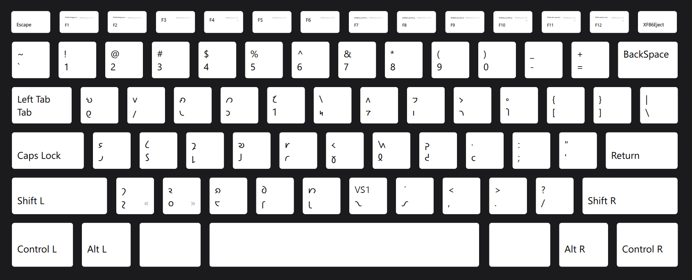
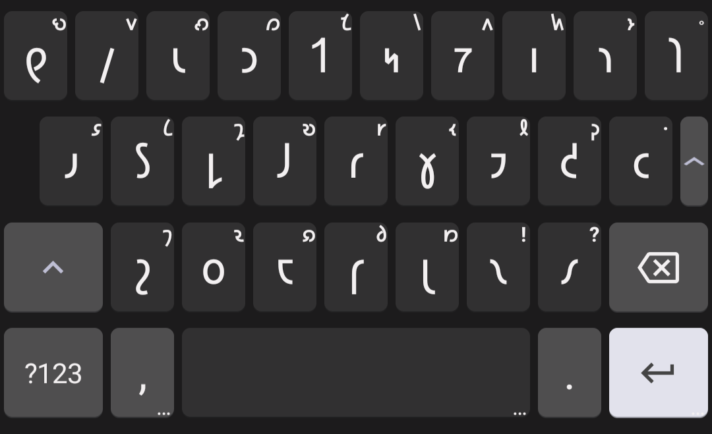

# ThWERTEe Shaw Layout

ThWERTEe is a QWERTY-derived keyboard layout for the Shavian alphabet, prioritizing accessibility and a mininal learning curve.  
It's available for XKB (Linux) and Heliboard (Android).

## Table of Contents

- [Overview](#overview)
   * [Key Features](#key-features)
- [Installation](#installation)
   * [Supported Keyboards](#supported-keyboards)
   * [Installing on XKB](#installing-on-xkb)
   * [Installing on Heliboard](#installing-on-heliboard)
- [Additional Usage Notes](#additional-usage-notes)
   * [XKB Performance Settings](#xkb-performance-settings)
   * [Heliboard Performance Settings](#heliboard-performance-settings)
   * [Extended Shavian](#extended-shavian)

## OVERVIEW

The intent of this Shavian layout is to preserve as much of the muscle-memory for QWERTY, english-speaking, latinic typing as possible.  
I designed this layout to feel intuitive and accessible for newcomers to Shavian who are already used to standard QWERTY. Oftentimes, typing in this layout will involve most or almost all of the same keystrokes as when typing in latinic QWERTY.   
I've also been dissatisfied with the astounding number of Shavian layouts that map Shavian characters to non-letter keys. This layout only uses the 26 latin character keys, and all other keys are unaffected. This allows for a much more intuitive typing experience.

### Key Features

- The main priority is that keys retain their latinic character's most-common phoneme, but in the Shavian script as often as possible:
   - **Consonants:** 15 of the 21 consonant keys have the corresponding Shavian phoneme character on their unshifted layer (e.g.; the `W`, `R`, and `T` keys have `𐑢`, `𐑮`, and `𐑑`, respectively, on their unshifted layers). Wherever possible, a consonant's flipped version is simply located on its shifted layer. 
   - **Vowels:** english vowel character pronunciations are extremely varied, but all vowel keys have most common or very common vowel phonemes on both shifted and unshifted layers. All other shavian vowels are placed near common pairings on the shifted layer.
   - **Ligatures:** Each ligature is usually on the shifted layer of a component character's key (e.g.; `𐑾` is on `shift`+`𐑩`). 
   - There are two exceptions to this general principle of most-common phonemes on unshifted keys: 
      - The `𐑲` character is placed on `shift`+`I`, because of the frequency (and therefore muscle-memory) of typing the pronoun "I" with that key combination.
      - The `𐑙` character is placed on unshifted `J` even though it's not among the 27 most common phonemes; this is simply to allow for faster typing of the gerund "ing" suffix.

- The layout includes standard and extended punctuation: 
   - The namer dot `·` and [acroring](https://shavian.neocities.org/crash-course#:~:text=The%20acroring%20precedes%20an%20initialism) `⸰` characters are both included on `shift`+`L` and `shift`+`P` keys, respectively. Their placement near the rest of the most-common punctuation keys is intentional.
   - For those localities where guillemets (`«`, `»`) are used, these characters are located on `alt`+`Z` and `alt`+`X`. 
   - The Unicode "Combining Acute Accent" mark (`◌́`) is also included; this is my personal contribution as a (hopeful/potential) solution to [the stressed Shavian vowel problem](https://shavian.neocities.org/dangit#:~:text=I%20Can%E2%80%99t%20Stress%20This%20Enough%20%28or%20At%20All). This accent mark is located on `shift`+`𐑥` (`shift`+`M`) - add it after a vowel to indicate that the stress goes on that syllable. 
      - <ins>_To be perfectly clear_</ins>: I'm simply adding this as an _option_, if you don't want to use it then don't. 

- The [extended Shavian](#extended-shavian) characters are supported by the inclusion of the Unicode "Variation Selector 1" (`VS1`) key, which is located on `shift`+`𐑯` (`shift`+`N`). 

#### Layout Screenshots

## INSTALLATION

### Supported Keyboards

ThWERTEe is currently available for use on the Heliboard keyboard app on Android, and on XKB on Linux. 

### Installing on XKB 

> [!IMPORTANT]
You will need root/admin permissions on your Linux machine to modify the configuration files. This is largely because XKB doesn't have a simple or intuitive way to install custom layouts to my knowledge. 

> [!CAUTION]
These instructions have worked for me, but I can't guarantee they will work for you, and in the worst case they could make your keyboard unusable. **Proceed with caution.**

1. **Locate where XKB stores its config files on your machine:**  
For my Fedora 42 machine, it's `/usr/share/X11/xkb/`, but the file structure differs between certain distributions so you _will_ have to do some legwork on your own here.  
This directory will be referred to as `[xkb]` for the installation steps.

2. **Put the layout file in the layout folder:**  
Copy the file `shavian` to `[xkb]/symbols/`. 

3. **Make a backup of your original `evdev.xml` file:**  
Copy `[xkb]/rules/evdev.xml` to another folder as a backup (e.g.; Desktop, Documents, etc.). This step is crucial: if you perform these steps incorrectly then your keyboard can easily become unusable, and making it usable again will be _much_ more difficult without a backup.

4. **Insert the addendum code into `evdev.xml`:**  
Open `[xkb]/rules/evdev.xml`, find the line that says `</layoutList>` (make sure the slash is there), and insert the contents of `add_to_evdev.xml` directly before that line. 

4. **Restart your computer:**  
Reboot so the changes are put into effect. (This step may not be necessary depending on your machine and distribution.)

5. **Activate your layout:**  
Open your System Settings and go to <ins>Keyboard</ins> > <ins>🞣 Add...</ins>. Type in `Shavian` in the search, select your new layout, and click <ins>OK</ins>.  
At the bottom, add a shortcut to switch between layouts (e.g.; `meta`+`space`). Click <ins>Apply</ins> when you're all done.

**You should now be able to type in Shavian in the ThWERTEe layout on your Linux!**

> [!IMPORTANT]
Sometimes an update will overwrite `[xkb]/rules/evdev.xml`, so if the layouts stop working after updating then you may need to repeat steps 3-5, possibly 6 as well.

***

### Installing on Heliboard

Installing on [Heliboard](https://github.com/Helium314/HeliBoard) is straightforward, and creating/editing layouts is relatively [well-documented](https://github.com/Helium314/HeliBoard/wiki/2.-Layouts):

1. **Open the Heliboard settings:**  
Either tap Heliboard in your apps, or long-press the `,` and slide it to the `⚙` icon. 

2. **Add a new language profile:**  
Tap <ins>Languages & Layouts</ins> at the top, and then either <ins>No language</ins> or <ins>English</ins> in your locality.  
<ins>No language</ins> is currently the only option that will let you automatically add Shavian words to a dedicated internal dictionary (titled "zz"), so I strongly recommend using that option. 

3. **Create a new keyboard layout file:**  
At the top, under <ins>Layout</ins>, tap the 🞣 icon. An ephemeral will pop up about adding custom layouts; just tap <ins>OK</ins>. 

4. **Copy the code:**  
Switch over to your browser (or however you're accessing this repo), open [ThWERTEe_mobile](heliboard/ThWERTEe_mobile.JSON), and copy the code to your clipboard. (Technically this step can be done at any point before the next step.)

5. **Paste the code into the layout file:**  
Name your layout file at the top; "ThWERTEe" makes the most sense, but you do you. Paste the code in the next text field and press <ins>Save</ins>. 

> [!NOTE]
If the <ins>Save</ins> button is greyed out and you can't tap it, it means that the code is out of format; go back and re-copy it from the repo. 
> If you were further customizing the layout on your own, you can also check your formatting for errors [here](https://jsoneditoronline.org/) and/or check [the docs](https://github.com/Helium314/HeliBoard/wiki/2.-Layouts).

6. **Customize the rest of your settings:**  
Experiment with the layout settings until everything works for you. 
See the [Heliboard Performance Settings](#heliboard-performance-settings) for details on what generally works.

7. **Use your new layout:**  
Switch to your new layout by holding down `,` and swiping to the `🌐` icon (the shortcut by default). If you'd prefer a designated key to switch language, go to <ins>Preferences</ins> > <ins>Additional keys</ins> > <ins>Language switch key</ins>. 

**You should now be able to type in Shavian on the ThWERTEe layout on Heliboard!**

## ADDITIONAL USAGE NOTES

### XKB Performance Settings 

#### Keyboard Shortcuts
- In certain situations, keyboard shortcuts will not work while using a Shavian XKB keyboard layout. The reasons for this are varied; certain applications, text fields, shortcuts, and permutations of those factors all contribute.
- This problem doesn't exist for just ThWERTEe, nor for just Shavian layouts. From my research and limited technical knowledge, non-latinic keyboard layouts seem to generally have these problems.  
- If anyone wants to troubleshoot this issue, I'll happily update this with the solution. 

### Heliboard Performance Settings 

#### Popup Settings
- The <ins>Popup key order</ins> hierarchy should be: 
<ins>Layout</ins> > <ins>Number row</ins> > <ins>Symbols</ins>.
- The <ins>Hint source</ins> heirarchy should be: 
<ins>Layout</ins> > <ins>Symbols</ins> > <ins>Number row</ins>.
- <ins>Language</ins> and <ins>Language (priority)</ins> don't really matter, even if your layout isn't set to <ins>No language</ins>. Heliboard would need to add a Shavian-dedicated .txt file to [locale_key_texts](https://github.com/Helium314/HeliBoard/tree/2fde28c19f9ec340e0669d15793f7086171a4f65/app/src/main/assets/locale_key_texts) with character associations for those two settings to work. 

### Extended Shavian

- The `VS1` character allows you to type some extra Shavian characters not included in Unicode.  
   - To access these characters, just add `VS1` at the end of the following characters while using a font that supports the extended characters: 𐑺, 𐑻, 𐑒, 𐑜, 𐑤, 𐑢. 
- These characters are extraneous for most applications, but may be useful in cases where conveying very specific pronunciation is necessary - such as in proper nouns or pronunciation notation.

> [!NOTE]
If a typeface or the fallback font doesn't support extended Shavian characters, `VS1` will simply have no effect on the character it's applied to - it shouldn't result in any Unicode placeholders or other errors. 

#### Supported Typefaces

- Full Support Typefaces
   - [Inter Alia](https://github.com/Shavian-info/interalia) 
   - [Playwrite Shavian](https://2gd4.me/tidbit/shavian-fonts.html#playwrite) - based on Playwrite by TypeTogether
   - [Couth #48 & #43](https://2gd4.me/tidbit/shavian-fonts.html#couth) - based on Courier Prime
   - [Hypercam](https://2gd4.me/tidbit/shavian-fonts.html#hypercam) - based on MS Windows 2 system font
   - [Atlanta](https://2gd4.me/tidbit/shavian-fonts.html#atlanta) - based on Georgia
- Limited Support Typefaces
   - [Hal](https://2gd4.me/tidbit/shavian-fonts.html#hal) - based on CGA 8×16 system font; available in sans and serif
   - [Iotacism #43](https://2gd4.me/tidbit/shavian-fonts.html#iotacism) - based on Iosevka by Belleve Invis
   - [Allstars](https://2gd4.me/tidbit/shavian-fonts.html#allstars) - based on the text from Super Mario All-Stars
