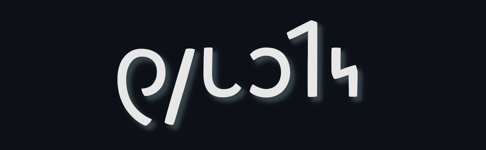

# ThWERTEe Shaw Layout

ThWERTEe is a QWERTY-derived keyboard layout for the Shavian alphabet, prioritizing accessibility and a minimal learning curve.  
It's available for XKB (Linux) and Heliboard (Android).

> _Installation guides are in the [wiki](https://github.com/JuGriz/ThWERTEe-Shavian-Keyboard/wiki)._

### Objective

The intent of this Shavian layout is to preserve as much of the muscle memory for QWERTY, english-speaking, latinic typing as possible; and that any deviations from that principle be easily justified, learned, and memorized. 

ThWERTEe is designed to feel intuitive and accessible for newcomers to Shavian who are already used to standard QWERTY. Whenever feasible, any differences from QWERTY are constructed around mnemonics and phoneme pairings.  
Oftentimes, typing in this layout will involve most or at least many of the same keystrokes as when typing in latinic QWERTY.  
The ThWERTEe layout only uses the 26 latin character keys, leaving the other keys unaffected. This contrasts with many other Shavian layouts which map characters to non-letter keys to accommodate the nearly-doubled character count. 

### Key Features

- The main priority is that keys retain their latinic character's most-common phoneme, but in the Shavian script:
   * **Consonants:** 15 of the 21 consonant keys have the corresponding Shavian phoneme character on their unshifted layer (e.g., the `W`, `R`, and `T` keys have `𐑢`, `𐑮`, and `𐑑`, respectively, on their unshifted layers). 
   * **Vowels:** All latinic vowel keys (including `Y`) have their most common or very common vowel phonemes on the shifted and unshifted layers. 3 (redundant) latinic consonant keys are repurposed for the remaining Shavian vowels on their unshifted layer.
   * **Syllabic Pairings:** Most ligatures and the remaining vowels are placed on a key with a phoneme that creates a common (or at least existent) phonetic pairing, so that the key's unshifted and shifted characters create syllables used in english (e.g., `𐑒𐑸`, `𐑝𐑾`, and `𐑣𐑬`). **Note** that this is primarily intended as a mnemonic aid, _not_ as an indicator of spelling or pronunciation conventions.
   * **Ligatures:** Each ligature is mapped as either a syllabic pairing or on the shifted layer of a component character's key (e.g., `𐑼` is on `shift`+`𐑮`). 
   * There are two exceptions to this general principle of english's most-common phonemes on their corresponding latinic, unshifted keys: 
      + The `𐑲` character is placed on `shift`+`I`, because of the frequency (and therefore muscle-memory) of typing the pronoun "I" with that key combination.
      + The `𐑙` character is placed on unshifted `J` even though it's not among the 27 most common phonemes; this is simply to allow for faster typing of the gerund "ing" suffix.

- The layout includes standard and extended punctuation: 
   * The namer dot `·` and [acroring](https://shavian.neocities.org/crash-course#:~:text=The%20acroring%20precedes%20an%20initialism) `⸰` characters are both included on `shift`+`L` and `shift`+`P` respectively. Their placement near the rest of the most-common punctuation keys is intentional.
   * For those localities where guillemets (`«`, `»`) are used, these characters are located on `alt`+`Z` and `alt`+`X` for XKB, and in the popups for `Z` and `X` for Heliboard. 
   * The Unicode "Combining Acute Accent" mark (`◌́`) is also included; this is a personal contribution as a (hopeful/potential) solution to [Shavian's stressed vowel problem](https://shavian.neocities.org/dangit#:~:text=I%20Can%E2%80%99t%20Stress%20This%20Enough%20%28or%20At%20All). This accent mark is located on `shift`+`𐑥` (`shift`+`M`) - add it after a vowel to indicate that the stress goes on that syllable. 
      + <ins>_To be perfectly clear_</ins>: I'm simply adding this as an _option_, if you don't want to use it then don't. 

- The [extended Shavian](https://github.com/JuGriz/ThWERTEe-Shavian-Keyboard/wiki/3.-Additional-Usage-Notes#extended-shavian) characters are supported by the inclusion of the Unicode "Variation Selector 1" (`VS1`) key, which is located on `shift`+`𐑯` (`shift`+`N`). 

## Installation

ThWERTEe is currently available for use on the Heliboard keyboard app on Android, and on XKB on Linux. 

Full installation guides are located in the wiki:
- [Heliboard Install Guide](https://github.com/JuGriz/ThWERTEe-Shavian-Keyboard/wiki/1.-ThWERTEe-on-Heliboard)

- [XKB Install Guide](https://github.com/JuGriz/ThWERTEe-Shavian-Keyboard/wiki/2.-ThWERTEe-on-XKB)

***

## Layout Images

#### XKB Layout

#### Heliboard Layout 

